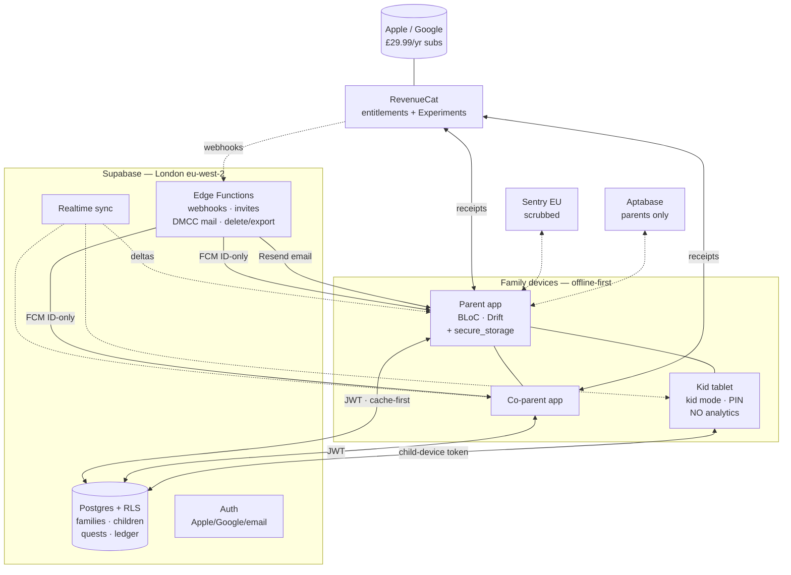

# Nestling — Tech Stack Decisions

**Date:** 30 Sep 2026 · **Scope:** UK-only launch, iOS + Android, Flutter 3.47.5, solo dev.
**Inputs:** ARCHITECTURE (bloc/get_it/go_router confirmed), DESIGN_SPEC, PRICING (£29.99/yr, 14-day trial, DMCC Jan 2027), MARKETING, `app/pubspec.yaml`.
**Rules for this doc:** one recommendation per row + one alternative + why. Costs at **launch** (~100 families) and **10k active families**. Every number carries a source URL; unverifiable items are marked **UNVERIFIED**. Another agent writes the setup checklist — rationale only, no step-by-step here.

**Principles:** (1) primary data in London (`eu-west-2`) or EU; US-only services get a DPIA note. (2) ICO Children's Code — **zero third-party analytics/ads/tracking calls in kid flows** (K01–K11, P17-over-kid); parent-flow services hard-gated by `AppMode`. (3) managed services over self-hosting (solo dev).

## 1. Client

| Decision | ✅ Recommended | 🔀 Alternative | Why |
|---|---|---|---|
| State | **flutter_bloc 9.x** (confirm — already in tree) | riverpod | Matches the one-bloc-per-feature contract; `bloc_test` + existing code. No migration. |
| DI | **get_it 9.x** (already in tree) | riverpod providers | Already wired via `register<Feature>`. Keep. |
| Routing | **go_router 18.x** (already in tree) | auto_route | Shell-route tab bar + kid-mode guard built. Keep. |
| Small flags/settings | **shared_preferences** | hive_ce | First-party; tokens never go here. |
| Tokens/secrets | **flutter_secure_storage** (Keychain/Keystore) | encrypted shared_prefs | Refresh tokens + kid PIN hash only. |
| Offline-first local DB | **Drift** (SQLite ORM) | ObjectBox | See below — decisive in 2026. |
| Caching | **Repository cache-first + TTL; cached_network_image** | hand-rolled file cache | Pip art ships bundled, so image cache is near-trivial. TTLs: quest library 24h, ledger/family 5min or invalidate on mutation. |
| Networking | **dio 5.x** | http | Interceptors (auth refresh, retry) + codegen-friendly. |
| Serialization | **freezed + json_serializable** | dart_mappable | Matches ARCHITECTURE.md (Equatable entities, fromJson/toJson); freezed gives union bloc states. dart_mappable is smaller but freezed is the boring, hireable choice. |
| Env/flavors | **--dart-define + 3 flavors (dev/stg/prod)** | flutter_dotenv files | No secrets in repo; works with fastlane + Actions matrix. |
| i18n | **flutter_localizations + intl, en-GB only** | slang | One locale: ARB holds `£`, `Sat 4 Oct`, UK spelling. slang overkill. |
| Accessibility | **Spec §9 as checklist** (44px parent / 56px kid, semantics labels) | — | Widget tests asserting tap-target sizes on `.btn-kid` + `Semantics` on icon-only buttons. |

**Local DB — pick Drift.** The 2026 maintenance landscape decides this, not benchmarks: **Isar is abandoned by its author** (only a volunteer `isar-community` fork survives); **Hive likewise stalled** (Hive CE fork); **Realm Device Sync hit EOL 30 Sep 2025** ([guide](https://luci-studio.com/blog/the-flutter-local-database-landscape-in-2026-a-maintenance-first-guide-fe6d267c/), [Isar #1737](https://github.com/isar/isar/issues/1737)). Remaining: **Drift** (healthy, sponsored by Stream + PowerSync, type-safe codegen, reactive streams, isolate support, migration test helpers) vs **ObjectBox** (healthy, commercial, v5.3.2 mid-2026, [changelog](https://pub.dev/packages/objectbox/changelog)) vs raw **sqflite**. ObjectBox's edge is built-in Data Sync — but our sync authority is the backend (Realtime + RLS), so we'd pay for sync twice and inherit UID-based migration fragility (`objectbox-model.json` clobbered = destructive on-device change). **Drift = relational ledger data in SQL, readable migration scripts, all platforms incl. web.** Cost £0 both scales. Children's Code: N/A (on-device).

## 2. Backend & data — **Supabase**

| Option | Verdict |
|---|---|
| ✅ **Supabase (Postgres + Auth + Realtime + Edge Functions), pinned to West Europe (London) `eu-west-2`** | **Recommended.** One managed Postgres with **RLS isolation per family** (exactly our sharing model), Auth (Apple/Google/email), Realtime for multi-device sync, Edge Functions for webhooks + DMCC emails. Maximal solo-dev leverage: no servers to host. Region available: [Supabase regions](https://supabase.com/docs/guides/platform/regions). GDPR/DPA: [docs](https://supabase.com/docs/guides/security/gdpr-compliance). DPIA caveat: Supabase Inc is US (Delaware), so SCCs apply — data still *resides* in London. |
| 🔀 Firebase (Firestore `europe-west2` London + Auth + FCM) | Alternative. Firestore London exists ([locations](https://firebase.google.com/docs/firestore/locations)); FCM/Crashlytics free. But: security rules are less expressive than Postgres RLS for family-member joins; Realtime Database has **no EU region**; FCM/Crashlytics process on **US infra with no EU region** ([analysis](https://sota.io/blog/firebase-eu-alternative-gdpr-cloud-act-2026) — opinionated source; treat CLOUD Act claims as UNVERIFIED, but the no-EU-region facts match Google's docs). Blaze is usage-metered ([pricing](https://firebase.google.com/pricing)) — Supabase's flat $25/mo is more predictable for a solo founder. |
| Appwrite/PocketBase/custom (Dart Frog/Serverpod on UK host) | Rejected v1: self-hosting trades cash for solo-dev nights (backups, patching, uptime). Revisit post-PMF. |

**Cost:** Launch — Free $0 ([pricing](https://supabase.com/pricing)). 10k families (~15–20k MAU; ledger rows are tiny) — **Pro $25/mo** (100k MAU, 8GB, 250GB bandwidth; [roundup](https://www.jetadmin.io/blog/supabase-pricing-2026-guide-to-plans-limits-and-real-world-costs/)); Realtime overages UNVERIFIED until measured.

**Data model (all tables carry `family_id`):** `families(id, payout_day, coin_value_pence, plan)` → `members(id, family_id, user_id→auth.users, role: owner|co-parent|child-device, invite_status)` → `children(id, family_id, nickname, age_band, avatar_colour, pin_hash, pip_state_coins)` (no email/photo/location columns — *by schema*) → `quests(...)` → `completions(id, quest_id, child_id, status: done|approved|not_yet, decided_by)` (approvals folded in — no separate table) → `ledger_entries(id, family_id, child_id, pence, kind: base|quest_bonus|manual|saving|spend, payout_batch_id)` → `rewards` + `redemptions` → `badges(id, child_id, badge_key, earned_at)`.
**RLS:** `USING (family_id IN (SELECT family_id FROM members WHERE user_id = auth.uid()))` on every family table; invites writable only by `role='owner'`; kid tablets get scoped JWTs from an Edge Function (`role='child-device'`: read own `child_id`, insert `completions` only). Service-role key lives only in Edge Functions (RevenueCat webhooks, payout batches).

## 3. Auth

| Decision | ✅ Recommended | 🔀 Alternative |
|---|---|---|
| Parent sign-in | **Supabase Auth: Sign in with Apple + Google + email/magic link** (all three per P03) | Firebase Auth / Auth0 |
| Co-parent invites | **Invite row + deep link** (owner creates `members` invite → Edge Function emails tokenised link → invitee signs in, claims seat) | Supabase Organizations (heavier than needed) |
| Child profiles | **NO accounts. Device-bound kid mode + optional 4-digit PIN** (K01 picker → K02 PIN; server `pin_hash`, local gate; math-question parental gate exits to parent mode) | Anonymous users per child (rejected — quasi-accounts for children, worse for the Code) |
| Sessions | **Supabase JWT (short-lived) + refresh in secure_storage; Edge Function mints scoped child-device tokens** | Custom JWT (rejected) |

**Notes:** Sign in with Apple is effectively **mandatory on iOS when offering Google** (Guideline 4.8; exemptions narrowed Jan 2024 — [9to5Mac](https://9to5mac.com/2024/01/27/sign-in-with-apple-rules-app-store/)). Supabase Auth runs in-region (London). £0 both scales. Children's Code: children never authenticate — ✅ by design.

## 4. Payments — **RevenueCat**

| | ✅ Recommended | 🔀 Alternative |
|---|---|---|
| IAP layer | **RevenueCat (purchases_flutter) over StoreKit 2 + Play Billing** | Raw `in_app_purchase` + own receipt server |

**Why:** Entitlements (`nestling_annual`) abstract receipt hell; Paywalls + **Experiments** run the PRICING.md 3-step plan (14d vs 30d, £24.99 vs £29.99) with no app release; **webhooks → Edge Function** set `families.plan` and trigger DMCC emails; Family Sharing is a store toggle (PRICING.md §3). Raw IAP saves the fee but costs weeks of receipt-validation + dunning + experiment infra — false economy. **Cost:** **£0 at launch and 10k families** — free to $2,500/mo tracked revenue, then 1% of MTR ([pricing](https://www.revenuecat.com/pricing)): 10k families at ~2.5% paid ≈ 250 × £29.99/yr ≈ ~$800/mo MTR → under threshold → £0. Experiments ships on Pro per [docs](https://www.revenuecat.com/docs/tools/experiments-v1/experiments-overview-v1) — Pro *is* the free-under-$2.5k tier, so included (verify at setup). DMCC: webhooks (trial-convert, renewal, cancel) drive **Day-12 + renewal emails** and cooling-off notices.

## 5. Notifications

| | ✅ Recommended | 🔀 Alternative |
|---|---|---|
| Push transport | **FCM via `firebase_messaging` + APNs (FlutterFire only — backend stays Supabase; Edge Function sends via FCM HTTP v1)** | OneSignal |
| Local | **`flutter_local_notifications` for payout-day + approval nudges** (scheduled on-device, works offline) | — |

**Why:** free, unlimited, the only sane APNs+Android story without a vendor; messaging-only FlutterFire, no Firestore/Analytics. Payloads carry IDs only ("3 quests waiting"), never child names — keeps FCM's US-processing footprint ([sota.io](https://sota.io/blog/firebase-eu-alternative-gdpr-cloud-act-2026)) DPIA-trivial. OneSignal: free to 1,000 MAU then Growth from $19/mo ([pricing](https://onesignal.com/pricing), [2026 caps](https://www.pushwoosh.com/blog/onesignal-free-plan-changes/)) + EU data centres ([blog](https://onesignal.com/blog/onesignals-data-centers-are-moving-to-the-eu/)) — nicer dashboard, but a second vendor + second DPA for what FCM does free. **Cost:** FCM £0 both scales. Children's Code: remote push targets **parent devices only**; kid tablet gets local celebrations, no remote profiling.

## 6. Analytics — **parent flow only, hard-disabled in kid mode**

| | ✅ Recommended | 🔀 Alternative |
|---|---|---|
| Product analytics | **Aptabase** (open-source, privacy-first, no device identifiers; self-hostable; free to 20k events/mo, paid from ~$10/mo — [site](https://aptabase.com/), [plans](https://aptabase.com/for-webapps)) | PostHog EU Cloud |

**Why Aptabase:** built for exactly this (mobile, privacy-first, no device identifiers; OSS/self-hostable; free to 20k events/mo, paid from ~$10/mo — [site](https://aptabase.com/), [plans](https://aptabase.com/for-webapps)). PostHog EU Cloud ([launch](https://posthog.com/blog/posthog-cloud-eu), [pricing](https://posthog.com/pricing): 1M events + 1M flag calls free) is more powerful but heavier SDK + autocapture culture that fights our Children's Code posture. **Firebase Analytics: rejected** (advertising-ID-adjacent, US processing). **Rule:** single `AnalyticsService` wrapper, initialised only after the P04 consent toggle (OFF by default); kid mode gets a compile-time `KidAnalytics.noop()` — not just a flag check — and no SDK init before consent. **Cost:** £0 launch; 10k families (parents only) ≈ £0–10/mo. EU hosting toggle — verify at setup (UNVERIFIED).

## 7. Crash/error reporting — **Sentry (EU region)**

| | ✅ Recommended | 🔀 Alternative |
|---|---|---|
| Crash reporting | **Sentry, org created in the EU (Germany) data region** | Firebase Crashlytics |

**Why:** **EU data residency at org creation** (permanent choice, [docs](https://docs.sentry.io/organization/data-storage-location/); [announcement](https://www.businesswire.com/news/home/20231112572027/en/Sentry-Announces-EU-Data-Region-Significant-Upgrades-to-its-Performance-Monitoring-Platform-and-Expansion-of-Ecosystem-Support)); Crashlytics is US-only. **PII scrubbing mandatory:** `beforeSend` drops emails and child nicknames (hash `child_id`), screenshots OFF in kid flows, breadcrumb allowlist. **Cost:** free tier covers launch; Team ~$26/mo ([roundup](https://www.koji.so/blog/sentry-alternatives-2026/)) only if volume demands.

## 8. Feature flags / remote config / price tests

| | ✅ Recommended | 🔀 Alternative |
|---|---|---|
| Flags + paywall experiments | **RevenueCat Paywalls + Experiments** (price/trial tests) **+ PostHog flags OR Aptabase-side config for non-price flags** | Firebase Remote Config |

**Why:** price/trial tests must live where the purchase happens — RevenueCat Experiments ([overview](https://www.revenuecat.com/feature/experiments)) per PRICING.md §5. For general flags (quest templates, outfits, copy): simplest v1 is a **Supabase `remote_flags` table polled at launch** (£0, London-resident, zero SDKs) — enough for 3–5 flags; graduate to PostHog flags (1M free evals/mo) when targeting is needed. Firebase Remote Config rejected (drags Firebase SDKs into a Children's-Code-sensitive app). **Cost:** £0 both scales. Kid-mode flags static/bundled where possible; no per-child targeting ever.

## 9. Media / storage / email / deep links

| Decision | ✅ Recommended | 🔀 Alternative | Notes |
|---|---|---|---|
| Media/storage | **No backend storage v1** (Pip art bundled; no child photos per spec) | Supabase Storage London | Only if photo-proof ever ships: in-region + RLS + DPIA update. £0. |
| Transactional email | **Resend** (Free: 3,000 emails/mo, 100/day, 3 domains; Pro $20/mo / 50k — [pricing](https://resend.com/pricing)) | Postmark ($15/mo 10k) | DMCC reminders **must** be email, not push (PRICING.md §6). **Resend chosen over Postmark**: free at launch volume, EU sending region on every plan ([multi-region for everyone](https://resend.com/changelog/multi-region-for-everyone)), and Supabase lists Resend as a supported custom SMTP ([Supabase](https://supabase.com/docs/guides/auth/auth-smtp), [Resend](https://resend.com/docs/send-with-supabase-smtp)). **Sending region `eu-west-1` (Ireland)**, chosen per domain at creation ([regions](https://resend.com/docs/dashboard/domains/regions)) — the region controls routing only; **all account data, logs and email metadata stay in the US**, so Resend is an Art. 28 processor and the ex-UK transfer rides the Resend DPA's **UK SCCs + UK Addendum** ([DPA](https://resend.com/legal/dpa)). Launch (<1k/mo) is **£0** on Free; 10k families ≈ 3–5k/mo exceeds both the 3k/mo cap and the 100/day cap → Pro ~$20/mo. Two paths: **Resend SMTP** (`smtp.resend.com:465`, user `resend`, password = API key) for Supabase Auth magic links/OTP, and the **Resend API from Supabase Edge Functions** for DMCC reminders, receipts/cooling-off notices and co-parent invites. Sender domain `mail.getnestling.co.uk`, From `noreply@mail.getnestling.co.uk`. DNS: Resend's **DKIM** (TXT) + **SPF** (TXT on the sending subdomain) + **Return-Path MX** on the same subdomain + **DMARC on the root** (`_dmarc.getnestling.co.uk`) — Resend does not create DMARC for you ([add a domain](https://resend.com/docs/add-a-domain)); SPF lives on a subdomain so keep DMARC at `aspf=r`. Verification usually lands in ~15 min, worst case 72h for DNS propagation. |
| Deep links (co-parent invites) | **App Links + Universal Links (`assetlinks.json` / `apple-app-site-association`) via `app_links`** | Firebase Dynamic Links (deprecated — rejected) | `https://getnestling.co.uk/invite/<token>` → store fallback if app absent. £0. |

## 10. CI/CD & quality

| Decision | ✅ Recommended | 🔀 Alternative |
|---|---|---|
| CI | **GitHub Actions** (build/test/analyze, Drift migration + golden tests) | Codemagic |
| Signing/deploy | **fastlane (match + supply/pilot)** on Actions | Codemagic signing (simpler, metered sooner) |
| Lint | **very_good_analysis (in dev_deps) + zero-warning gate** | default lints (weaker) |
| Tests | **unit (ledger math) → bloc_test per feature → widget (tap-target sizes + Pip goldens) → 1 integration smoke (onboarding→paywall→today) on Test Lab pay-per-run** | — |
| Dependencies | **Dependabot weekly + `flutter pub outdated` in CI (advisory)** | Renovate |

**Why Actions over Codemagic:** Actions free tier (2,000 min/mo) covers a solo dev; fastlane match keeps signing portable. Codemagic's DX is nicer but metered from day one — switch if macOS queues hurt. **Cost:** £0 launch; ~£0–30/mo later (device-farm runs). Flavors dev/stg/prod → TestFlight internal → closed → production.

## 11. Security & compliance

| Item | Decision |
|---|---|
| DPIA | **Write pre-launch** (ICO template): lawful basis, Code 15-standard walk-through, data-flow map, kid-flow SDK inventory = **empty**. |
| ICO registration | **Tier 1: £52/yr (£47 by Direct Debit)** — micro-organisation ≤10 staff ([gov.uk](https://www.gov.uk/data-protection-register-notify-ico-personal-data), [ICO](https://ico.org.uk/for-organisations/data-protection-fee/)). |
| Deletion | **Settings → "Delete family account"** (P16) → Edge Function cascade-deletes `families` + Auth user, cancels store subscription, confirms by email ≤30 days. "Download our data" = Edge Function CSV/JSON export. |
| Retention | Active accounts keep ledger history; deleted accounts purged ≤30 days; crash reports 90 days; emails per Resend 30-day data retention on the Free tier ([pricing](https://resend.com/pricing)). |
| Encryption | TLS 1.2+ in transit; AES-256 at rest (AWS London); tokens in Keychain/Keystore; Argon2/bcrypt `pin_hash`, never the PIN. |
| Backups | Supabase daily backups (Pro 7-day retention); PITR add-on UNVERIFIED — confirm in dashboard. Pre-release `pg_dump` before migrations. |
| Processor list (Art. 28/30) | Supabase (London, DPA+SCCs), Apple/Google (merchants of record), RevenueCat, Resend (email — sends from Ireland `eu-west-1`, account data in the US, UK SCCs + Addendum in its [DPA](https://resend.com/legal/dpa)), Sentry EU, Aptabase (parent-flow only). No adtech. Publish in Privacy Notice. |

## 12. Recommended stack at a glance

| Layer | Choice | Launch cost | 10k families | Region | Kid-flow safe? |
|---|---|---|---|---|---|
| State/DI/routing | flutter_bloc + get_it + go_router | £0 | £0 | on-device | ✅ |
| Local DB | Drift (+ shared_prefs + secure_storage) | £0 | £0 | on-device | ✅ |
| Network/serial | dio + freezed/json_serializable | £0 | £0 | on-device | ✅ |
| Backend/auth/DB | Supabase Pro, London `eu-west-2` | £0 (Free) | ~£20/mo ($25) | London | ✅ |
| Payments | RevenueCat | £0 | £0 (<$2.5k MTR) | US SaaS | ✅ |
| Push | FCM messaging-only + local | £0 | £0 | FCM US (IDs only) | ✅ |
| Analytics | Aptabase, parents only, consent-gated | £0 | £0–8/mo | EU/verify | ✅ |
| Crash | Sentry EU + PII scrubbing | £0 | £0–20/mo | Germany (EU) | ✅ |
| Flags | Supabase `remote_flags` → PostHog later; price tests in RC Experiments | £0 | £0 | London | ✅ |
| Email | Resend | £0 (Free, 3k/mo) | ~£16/mo ($20 Pro) | sends `eu-west-1` (Ireland); account data US | ✅ |
| CI/CD | GitHub Actions + fastlane | £0 | £0–25/mo | — | ✅ |
| Compliance | ICO fee + DPIA | ~£47/yr | ~£47/yr | UK | ✅ |

**Indicative run-rate: launch ≈ £0/mo + £47/yr · 10k families ≈ £49–69/mo + £47/yr** (excl. 15% store fees and 20% VAT in shelf price — PRICING.md §3). **Email is £0 at launch** on Resend's free tier (3,000/mo, 100/day) — that line was the entire £12/mo launch run-rate under Postmark. At 10k families ~3–5k emails/mo breaks both the 3k/mo cap and the 100/day cap, so it moves to Pro ~$20/mo (~£16, +~£4/mo vs Postmark). Re-confirm all vendor figures at signup.

*End of TECH_STACK.md — decisions complete. Over to the setup-checklist agent.*
